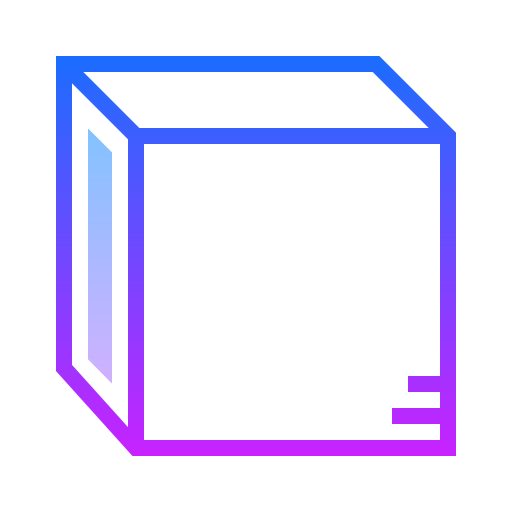
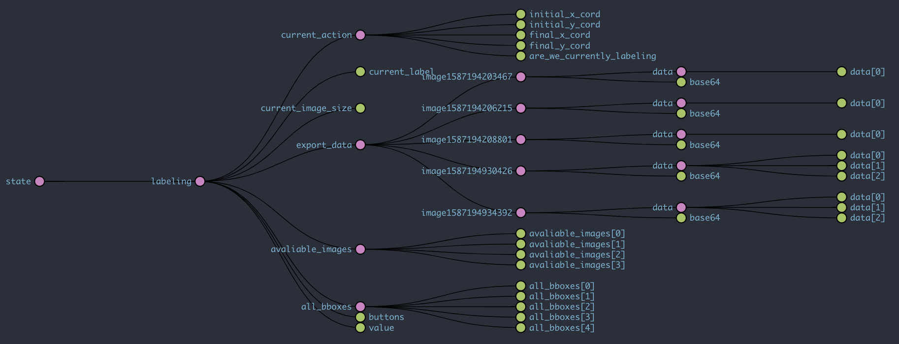

<h1 align="center">Labeling for Machine Learning Made Simple</h1>
<p align="center">
  <a href="https://github.com/daniel-sudz/UWB-Hackathon/actions/">
    
  </a>
</p>


<p align="center">
</p>
<p align="center">
  
   
    
</p>

# Category 1: README

## Technologies Used 
Google Cloud Functions <br>
Firebase Storage Buckets <br>
Google Cloud Auto-ML <br>
Github Actions for CI/CD <br>
React-Native for UI 

## Goal of the Project
Training image classification models is tedious. A user first has to gather images from a phone or camera, figure out how to send those images to a computer, download a labeling app for desktop, export the labeling data into a proper format, and finally begin training. 
<br> <br>
With our app, all of this is taken care of. A user simply takes picture on their phone, labels them straight on their phone, and sends off the data to be converted into a proper format without leaving the app. 

## Control Flow 

Step 1: A user downloads our app <br>
Step 2: A user takes pictures from their phone <br>
Step 3: A user imports images from our app <br>
Step 4: A user draws bounding boxes through the app <br>
Step 5: A user selects to export their labeled data <br>
Step 6: The user data is send to a firebase cloud function <br>
Step 7: The firebase cloud function forwards image data to firebase storage buckets<br>
Step 7: The firebase cloud function assembles an auto-ML formatted CSV file with references to the bucket and data<br>
Step 8: The firebase cloud function returns the csv file to the user <br>
Step 8: The user can drag and drop the csv file to their autoML console which will begin traning :) <br>

The data stored in the storage bucket has public read acesss avaliable so the user will be able to import the csv file for as long as the data remains in the cloud bucket. 

## Data Layer


### Rational 

To simply the making of the app, we employed redux state managment along with react hooks. 

### Examples
As a user drags his finger to draw a bounding box, the current action data field is changed which is reflected by the changing bounding box on the screen. 
<br>
<br>
When the user finishes dragging his finger, his changes are pushed to the all_bbox data field 
<br>
<br>
When a user navigates to a new image, the labeling data is stashed to export_data and a new imaged is poped from avaliable_images. 

### Effect

Employing redux state managments greatly reduces the number of nested components. Using redux hooks, each component can live as a function in its own file and can hook into redux state as its needed. With this model, code reuse and readability is improved.

## Issues encountered 

# Category 2: User Experience Example

## App experience 

### Splash screen

## Selecting an image 

## Labeling window 

## Video example of drawing bounding boxes 

## Video example of posting data to API endpoint 

## API Enpoint

You can test the API itself yourself by posting data to the cloud function 
```
https://us-central1-bboxlabeler.cloudfunctions.net/api
```

### Sample data

Here is a data sample that is generated by the app which would then be posted to endpoint: 

```json
{
  "image1": {
    "base64": "data:image/jpeg;base64,/9j/4AAQSkZJRgABAQAAAQABAAD//gAfQ29tcHJlc3NlZCBieSBqcGVnLXJlY29tcHJlc3P/2wCEAAQEBAQEBAQEBAQGBgUGBggHBwcHCAwJCQkJCQwTDA4MDA4MExEUEA8QFBEeFxUVFx4iHRsdIiolJSo0MjRERFwBBAQEBAQEBAQEBAYGBQYGCAcHBwcIDAkJCQkJDBMMDgwMDgwTERQQDxAUER4XFRUXHiIdGx0iKiUlKjQyNEREXP/CABEIABAAEAMBIgACEQEDEQH/xAAWAAEBAQAAAAAAAAAAAAAAAAAEBQj/2gAIAQEAAAAA1bYOz//EABQBAQAAAAAAAAAAAAAAAAAAAAT/2gAIAQIQAAAAV//EABQBAQAAAAAAAAAAAAAAAAAAAAD/2gAIAQMQAAAAf//EACUQAAIBBAEBCQAAAAAAAAAAAAIEAwEFERIABhQVITJBQlFSYf/aAAgBAQABPwDtN4ufUl3t67kukJyaUoycA0ADpT2if25B3/ZHUTYZpIqzOC0kZsnOWx+Uh2jDGPX54KTti6ofuBozsqtRyVA1w3KhmQVqJDnwxrx55y6N2WBezOhHG9HNNLNHoICGf3n/xAAZEQADAAMAAAAAAAAAAAAAAAABAhIAIcH/2gAIAQIBAT8AY7UKFmOZ/8QAFxEAAwEAAAAAAAAAAAAAAAAAABNhMf/aAAgBAwEBPwBVun//2Q==",
    "data": [
    {
      "min_x": 0.5,
      "max_x": 0.6, 
      "min_y": 0.7, 
      "max_y": 0.8, 
      "label": "dog"
    },
    {
      "min_x": 0.9,
      "max_x": 1.0, 
      "min_y": 0.8, 
      "max_y": 0.4, 
      "label": "cat"
    }
    ]
  }
}
```

As you can see, the data describes one image with name image1 that contains the two bounding boxes with labels cat and dog. 
<br>
The API responds to this request by uploading the provided base64 image to a storage bucket and then returning a csv file. 

### API Response: CSV File

```
set,path,label,x_min,y_min,x_max,y_min,x_max,y_max,x_min,y_max
TEST,gs://coronatime-7b908.appspot.com/image1.jpg,dog,0.5,0.7,0.6,0.7,0.6,0.8,0.5,0.8
TRAIN,gs://coronatime-7b908.appspot.com/image1.jpg,cat,0.9,0.8,1,0.8,1,0.4,0.9,0.4
```

If this first line is removed, this CSV file is a valid Google AutoML metafile. The user would see a popup in their app with the ability to copy the CSV file for their own safe keeping. In the future, we would probably ask the user to enter an email, so the CSV file could be emailed to them for the sake of convenience. 


The google storage bucket that the images were uploaded to is publicly read-only. This means that the user would be able to upload the returned CSV file to either Gcloud AutoML or Firebase MLkit to begin training their model. 

# Category 3: Implementation Details

## Redux State Managment Control Flow Diagram 

