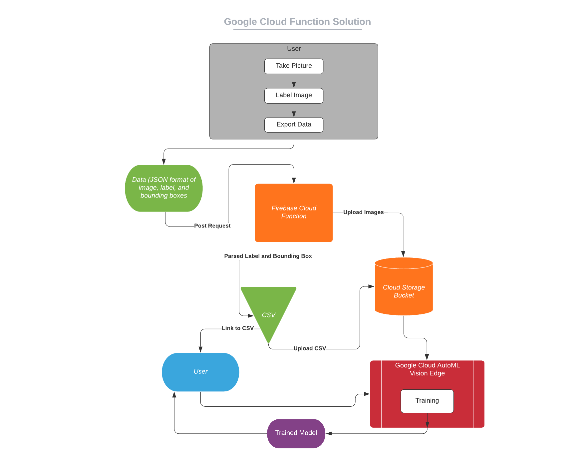
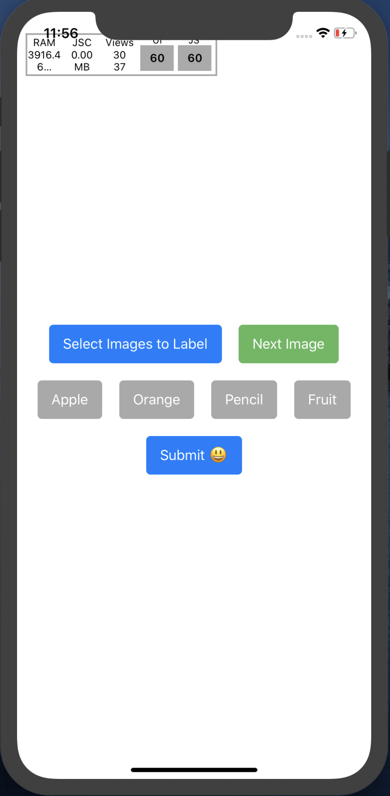
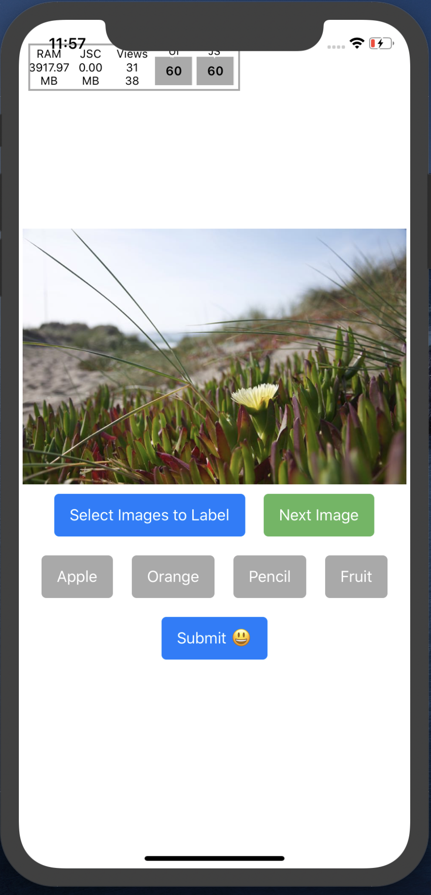

<h1 align="center">Labeling for Machine Learning Made Simple</h1>
<p align="center">
  <a href="https://github.com/daniel-sudz/UWB-Hackathon/actions/">
    
  </a>
</p>


<p align="center">
</p>
<p align="center">
  
</p>

# Category 1: README

## About Us
<p align="center">
  
  
</p>
Daniel Sudzilouski (left): junior at Tesla Stem High School, developed the react-native app <br>
Jason Zhang (right): junior at Eastlake High School, developed the cloud-based solution

## Technologies Used 
Google Cloud Functions <br>
Firebase Storage Buckets <br>
Google Cloud Auto-ML <br>
Github Actions for CI/CD <br>
React-Native for UI 

## Goal of the Project
Training image classification models is tedious. A user first has to gather images from a phone or camera, figure out how to send those images to a computer, download a labeling app for desktop, export the labeling data into a proper format, and finally begin training. 
<br> <br>
With our app, all of this is taken care of. A user simply takes picture on their phone, labels them straight on their phone, and sends off the data to be converted into a proper format without leaving the app. 


<table>
  <tr>
    <td>Overview of our cloud-based solution</td>
  </tr>
  <tr>
    <td></td>
  </tr>
 </table>

## Control Flow 

1) ✅ A user downloads our app <br>
2) ✅ A user takes pictures from their phone <br>
3) ✅ A user imports images into our app <br>
4) ✅ A user draws bounding boxes through the app <br>
5) ✅ A user selects to export their labeled data <br>
6) ✅ The user data is send to a firebase cloud function <br>
7) ✅ The firebase cloud function forwards image data to firebase storage buckets <br>
8) ✅ The firebase cloud function assembles an auto-ML formatted CSV file with references to the bucket and data<br>
9) ✅ The firebase cloud function returns the csv file to the user <br>
10) ✅ The user can drag and drop the csv file to their autoML console which will begin traning <br>

The data stored in the storage bucket has public read acesss avaliable so the user will be able to import the csv file for as long as the data remains in the cloud bucket. 

## Data Layer (for labeling app)


### Rational 

To simply the making of the app, we employed redux state managment along with react hooks. 

### Examples
1) As a user drags his finger to draw a bounding box, the current action data field is changed which is reflected by the changing bounding box on the screen. 
2) When the user finishes dragging his finger, his changes are pushed to the all_bbox data field 
3) When a user navigates to a new image, the labeling data is stashed to export_data and a new imaged is poped from avaliable_images. 

### Effect

Employing redux state managments greatly reduces the number of nested components. Using redux hooks, each component can live as a function in its own file and can hook into redux state as its needed. With this model, code reuse and readability is improved.

## Issues encountered / Hope for the future 
1) We wanted to make the experience fully automatic 🤖 but didn't have time to figure out how to automate the begin-training part with Google AutoML. In the end we decided that this feature isn't actually needed because the app already has pretty low friction and we would't want to pay for someone else's data training. 
2) For some reason the API crashes 💥when png images are uploaded instead of jpg images. We need to figure out what is up with the base64 to image converter library we are using. 
3) ~~We would like to add an email 📧 API so that a user would recieve an email with their generated CSV file upon posting to the server. We didn't have time to do this. Currently, the user just recieves the CSV file back in plain text that they can copy.~~ Upon choosing to export, the app opens up an email client with the csv link so that the user can easily email the link to themselves. This is no longer a problem.
4) We had difficulty initially sending a request to our cloud function. It turns out that GET requests cannot carry a body message so we just needed to switch to POST requests.
5) Sometimes uploading to the firebase storage buckets gets messed up. We are still working on increasing the consistency and speed. 

# Category 2: User Experience Example

## App experience 

<h3 align="center">User experience on the app</h3>
<p align="center">
  <a href="https://img.shields.io/badge/Minimized-4KB-brightgreen.svg">
    
  </a>
</p>


### Splash screen / Labeling Page

<table>
  <tr>
    <td>Page on loading of app</td>
     <td>Page after selecting an image to label</td>
  </tr>
  <tr>
    <td></td>
    <td></td>
  </tr>
 </table>
 
### Selecting images 


<table>
  <tr>
    <td>A user importing images</td>
    <td>A user labels a picture with oranges</td>
  </tr>
  <tr>
    <td></td>
    <td></td>
    
  </tr>
 </table>

### Full client example 

### Video example of posting data to API endpoint 

## API Enpoint

You can test the API itself yourself by posting data to the cloud function 
```
https://us-central1-bboxlabeler.cloudfunctions.net/api
```

### Sample data

Here is a data sample that is generated by the app which would then be posted to endpoint: 

```json
{
  "image1": {
    "base64": "data:image/jpeg;base64,/9j/4AAQSkZJRgABAQAAAQABAAD//gAfQ29tcHJlc3NlZCBieSBqcGVnLXJlY29tcHJlc3P/2wCEAAQEBAQEBAQEBAQGBgUGBggHBwcHCAwJCQkJCQwTDA4MDA4MExEUEA8QFBEeFxUVFx4iHRsdIiolJSo0MjRERFwBBAQEBAQEBAQEBAYGBQYGCAcHBwcIDAkJCQkJDBMMDgwMDgwTERQQDxAUER4XFRUXHiIdGx0iKiUlKjQyNEREXP/CABEIABAAEAMBIgACEQEDEQH/xAAWAAEBAQAAAAAAAAAAAAAAAAAEBQj/2gAIAQEAAAAA1bYOz//EABQBAQAAAAAAAAAAAAAAAAAAAAT/2gAIAQIQAAAAV//EABQBAQAAAAAAAAAAAAAAAAAAAAD/2gAIAQMQAAAAf//EACUQAAIBBAEBCQAAAAAAAAAAAAIEAwEFERIABhQVITJBQlFSYf/aAAgBAQABPwDtN4ufUl3t67kukJyaUoycA0ADpT2if25B3/ZHUTYZpIqzOC0kZsnOWx+Uh2jDGPX54KTti6ofuBozsqtRyVA1w3KhmQVqJDnwxrx55y6N2WBezOhHG9HNNLNHoICGf3n/xAAZEQADAAMAAAAAAAAAAAAAAAABAhIAIcH/2gAIAQIBAT8AY7UKFmOZ/8QAFxEAAwEAAAAAAAAAAAAAAAAAABNhMf/aAAgBAwEBPwBVun//2Q==",
    "data": [
    {
      "min_x": 0.5,
      "max_x": 0.6, 
      "min_y": 0.7, 
      "max_y": 0.8, 
      "label": "dog"
    },
    {
      "min_x": 0.9,
      "max_x": 1.0, 
      "min_y": 0.8, 
      "max_y": 0.4, 
      "label": "cat"
    }
    ]
  }
}
```

As you can see, the data describes one image with name image1 that contains the two bounding boxes with labels cat and dog. 
<br>
The API responds to this request by uploading the provided base64 image to a storage bucket and then returning a csv file. 

### API Response: CSV File

```
TEST,gs://coronatime-7b908.appspot.com/image1.jpg,dog,0.5,0.7,0.6,0.7,0.6,0.8,0.5,0.8
TRAIN,gs://coronatime-7b908.appspot.com/image1.jpg,cat,0.9,0.8,1,0.8,1,0.4,0.9,0.4
```
This CSV file is a valid Google AutoML metafile. ~~The user would see a popup in their app with the ability to copy the CSV file for their own safe keeping. In the future, we would probably ask the user to enter an email, so the CSV file could be emailed to them for the sake of convenience.~~ Adressed above. The app now opens an email client with a link to the csv file so that they can easily email it to themselves and import the csv file to Google AutoML if they want to begin training.


The google storage bucket that the images/csv file were uploaded to is publicly read-only. This means that the user would be able to upload the returned CSV file to either Gcloud AutoML or Firebase MLkit to begin training their model. 

# Category 3: Implementation Details

## Repository 

Look around the various branches to find all the code that was written to make this user experience possible. 

### Branch redux-refactor 

This branch contains all the code used for the react-native labeling app. The following libraries were employed in the making of the app: react-native for UI, redux for state managment, react-native-image-crop-picker for picking images from gallery, and NativeBase so that the buttons do not look hiedeous. 

Find the code at: 
https://github.com/daniel-sudz/UWB-Hackathon/tree/redux-refactor

## Branch firebase 

This is the branch that contains all the code used for the cloud function and firebase storage buckets. 

Find the code at: 
https://github.com/daniel-sudz/UWB-Hackathon/tree/firebase

## Branch Master 

This is the branch for our documentation. We hope that you have enjoyed it and that all the images/videos have worked for you. 
