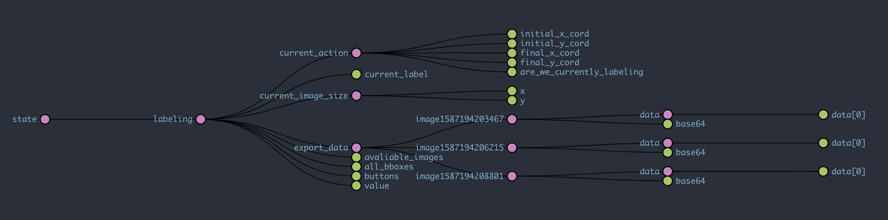

<h1 align="center">Labeling for Machine Learning Made Simple</h1>

  

  
   
    

# Category 1: README

## Technologies Used 
Google Cloud Functions  
Firebase Storage Buckets  
Google Cloud Auto-ML  
Github Actions for CI/CD  
React-Native for UI 

## Goal of the Project
Training image classification models is tedious. A user first has to gather images from a phone or camera, figure out how to send those images to a computer, download a labeling app for desktop, export the labeling data into a proper format, and finally begin training. 
   
With our app, all of this is taken care of. A user simply takes picture on their phone, labels them straight on their phone, and sends off the data to be converted into a proper format without leaving the app. 

## Control Flow 

Step 1: A user downloads our app  
Step 2: A user takes pictures from their phone  
Step 3: A user imports images from our app  
Step 4: A user draws bounding boxes through the app  
Step 5: A user selects to export their labeled data  
Step 6: The user data is send to a firebase cloud function  
Step 7: The firebase cloud function forwards image data to firebase storage buckets 
Step 7: The firebase cloud function assembles an auto-ML formatted CSV file with references to the bucket and data 
Step 8: The firebase cloud function returns the csv file to the user  
Step 8: The user can drag and drop the csv file to their autoML console which will begin traning :)  

The data stored in the storage bucket has public read acesss avaliable so the user will be able to import the csv file for as long as the data remains in the cloud bucket. 

## Data Layer

## Issues encountered 

# Category 2: User Experience Example

# Category 3: Implementation Details

## Redux State Managment Control Flow Diagram 

